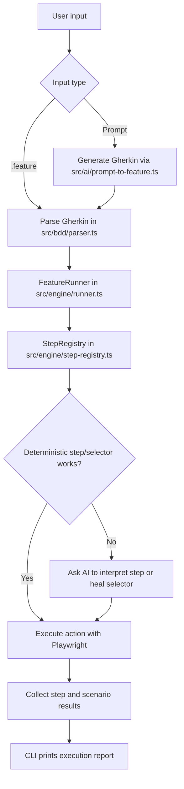
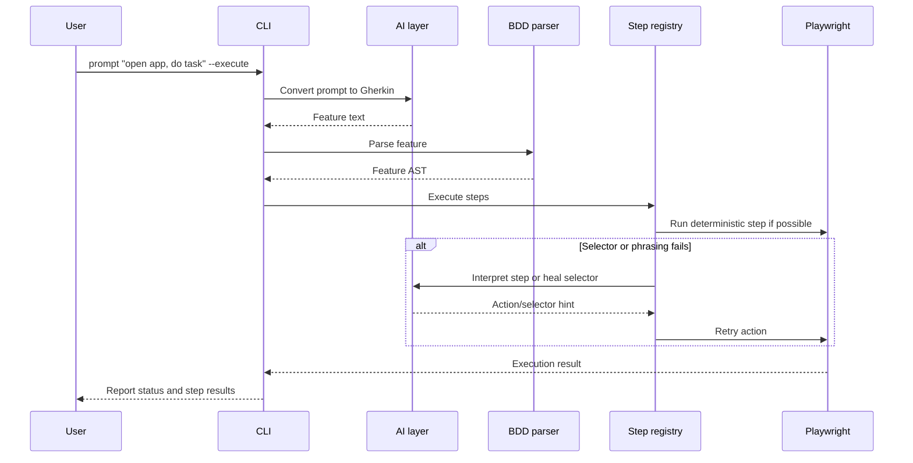

# os-heybugs

os-heybugs is an open source AI-assisted execution engine for BDD-style UI automation built on top of Playwright.

The goal is to keep the core small, but still close to the Heybugs engine pattern:

- users write BDD scenarios in a readable feature file format
- users can also write a natural-language prompt and let the engine convert it to BDD
- the engine parses the scenarios or prompt output
- Playwright executes the browser automation in the background
- AI helps infer selectors, recover broken locators, and interpret less rigid step phrasing
- the deterministic engine is still used first as a fast path when a direct match already works
- teams can extend the default step registry with their own selectors and behaviors
- AI access is configured through `.env`

## What this repo contains

- a lightweight BDD parser
- a Playwright-backed step runner
- a default set of UI actions
- a CLI for running feature files
- an example feature file you can use as a starting point

## Quick start

```bash
npm install
npm run build
cp .env.example .env
npm run build
npm run sample
```

To run your own feature file:

```bash
node dist/cli.js run path/to/your.feature --base-url http://localhost:3000 --headless
```

To turn a natural-language request into automation:

```bash
npm run prompt -- "user logs in and reaches the dashboard"
npm run prompt -- "user logs in and reaches the dashboard" --execute
```

`HEYBUGS_AI_API_KEY` is optional. You need it when you want the AI-backed behavior: prompt-to-feature generation, selector inference/healing, and AI interpretation of step phrasing that the non-AI engine does not understand directly.

If you want AI generation enabled, set `HEYBUGS_AI_API_KEY` (or provider-specific key) in `.env`. The engine uses an OpenAI-compatible chat-completions endpoint by default, so it can work with providers that follow that API shape.

### Multi-provider setup

os-heybugs can run with:

- OpenAI-compatible endpoints
- OpenRouter
- Gemini (OpenAI-compatible endpoint)
- Claude (Anthropic Messages API)
- Ollama local
- Mock mode (no external AI call)

Example `.env` snippets:

```bash
# OpenAI-compatible (default)
HEYBUGS_AI_PROVIDER=openai-compatible
HEYBUGS_AI_API_KEY=your_openai_key
HEYBUGS_AI_API_BASE_URL=https://api.openai.com/v1
HEYBUGS_AI_MODEL=gpt-4o-mini
```

```bash
# OpenRouter
HEYBUGS_AI_PROVIDER=openrouter
HEYBUGS_AI_API_KEY=your_openrouter_key
HEYBUGS_AI_API_BASE_URL=https://openrouter.ai/api/v1
HEYBUGS_AI_MODEL=openai/gpt-4o-mini
```

```bash
# Gemini (OpenAI-compatible endpoint)
HEYBUGS_AI_PROVIDER=gemini
HEYBUGS_AI_API_KEY=your_gemini_key
HEYBUGS_AI_API_BASE_URL=https://generativelanguage.googleapis.com/v1beta/openai
HEYBUGS_AI_MODEL=gemini-1.5-flash
```

```bash
# Claude (Anthropic)
HEYBUGS_AI_PROVIDER=claude
HEYBUGS_AI_API_KEY=your_anthropic_key
HEYBUGS_AI_API_BASE_URL=https://api.anthropic.com/v1
HEYBUGS_AI_MODEL=claude-3-5-sonnet-latest
```

```bash
# Ollama local
HEYBUGS_AI_PROVIDER=ollama
HEYBUGS_AI_API_BASE_URL=http://localhost:11434/v1
HEYBUGS_AI_MODEL=llama3.1:8b
# Optional when ollama is behind gateway auth
HEYBUGS_AI_API_KEY=
```

`HEYBUGS_AI_API_KEY` is the universal key used by the AI layer for prompt-to-automation and AI selector self-healing requests. If this key is empty, os-heybugs falls back to provider-specific keys (`OPENAI_API_KEY`, `OPENROUTER_API_KEY`, `GEMINI_API_KEY`, `ANTHROPIC_API_KEY`) and then to heuristic mode when no key is available (except local Ollama which can run without key).

## Feature file format

```gherkin
Feature: Login flow

  Background:
    Given I go to "/login"

  Scenario: User signs in
    When I fill "Email" with "demo@example.com"
    And I fill "Password" with "secret"
    And I click "Sign in"
    Then I should see "Dashboard"
```

## Architecture

The project is split into three layers:

- `src/bdd` parses feature files into an internal AST
- `src/ai` turns prompts into Gherkin and can assist selector recovery
- `src/config` loads `.env` values into runtime automation config
- `src/engine` executes steps with Playwright and self-healing selector fallback
- `src/cli.ts` provides a thin command line wrapper

## How It Works (End-to-End)

The product story is:

- users describe intent in `.feature` or natural language
- AI helps understand steps and find selectors when needed
- Playwright executes the real browser actions in the background
- deterministic matching stays as the fast path when a direct step already works

There are two input paths that meet in the same execution runner:

1. Feature file path (`run` command)
2. Natural-language prompt path (`prompt --execute` command)

### Execution model



### 1) Feature file execution flow

When you run:

```bash
node dist/cli.js run examples/todomvc-add-todo.feature --headed
```

the engine does this:

1. CLI parses flags such as `--headless`, `--base-url`, `--timeout`, and `--trace-dir`.
2. Environment is loaded from `.env` via `src/config.ts`.
3. The `.feature` file is parsed by `src/bdd/parser.ts` into an internal AST (`FeatureDoc`).
4. `FeatureRunner` in `src/engine/runner.ts` launches Playwright browser/context/page.
5. Each step is sent to `src/engine/step-registry.ts`.
6. The registry tries a direct deterministic action first.
7. If the step phrasing is unfamiliar, AI can translate that step into a runnable action.
8. If the step is understood but the locator fails, AI selector healing can recover it.
9. Playwright performs the actual navigation, typing, clicking, and assertions.
10. CLI prints the final report.

### 2) Prompt-to-automation flow

When you run:

```bash
node dist/cli.js prompt "open SauceDemo, type standard_user and secret_sauce, hit the login button, then confirm the Products title is shown" --execute --headed
```

the engine does this:

1. Sends the natural-language request to `src/ai/prompt-to-feature.ts`.
2. AI converts that request into Gherkin.
3. The generated Gherkin is parsed by the same BDD parser.
4. The same `FeatureRunner` and `StepRegistry` execute it.
5. Playwright still performs the real browser execution.

So prompt mode and feature mode share one runtime. The only difference is whether Gherkin came from the user directly or was generated from a prompt first.

### Prompt flow diagram



### Step execution model

The runtime is AI-assisted, but it still starts from deterministic matching. Common direct mappings are:

- `I go to "..."` -> `page.goto(...)`
- `I fill "Label" with "Value"` -> label/placeholder/textbox lookup + `fill(...)`
- `I click "Target"` -> role/text/label lookup + `click()`
- `I should see "Text"` -> visible text assertion

If a direct handler does not match, the automation-aware engine can ask AI to interpret the step into a normalized browser action such as `goto`, `fill`, `click`, `press`, `see`, or URL checks.

### Selector healing and AI fallback

`createAutomationAwareRegistry(...)` wraps execution with a layered strategy:

1. Try deterministic step handling first.
2. If no handler matches and AI is configured, ask AI to interpret the step.
3. If the action is understood but the selector fails, call `src/engine/selector-healer.ts`.
4. Retry with the AI-guided selector or action.

This is the main value of the project: users focus on intent and visible UI, while Playwright handles execution and AI helps avoid raw selector authoring.

### Data-driven scenarios

The parser supports:

- `Scenario`
- `Scenario Outline` / `Scenario Template`
- `Examples` tables

Each example row is expanded into a concrete scenario before execution, so reports show per-row results.

### Extending behavior

To add custom domain steps:

1. Create a `StepRegistry` instance.
2. Register a regex and handler.
3. Pass that registry to `FeatureRunner`.

This keeps Gherkin readable for non-engineers while still allowing app-specific actions in code.

## Heybugs Reference Model

This open-source engine mirrors the Heybugs idea of treating BDD as an Action Palette item rather than a separate code path.

- `Action Palette: BDD` maps to the BDD Scenario entry in the builder UI.
- BDD is treated as prompt-to-automation, so natural language and Gherkin can both resolve into executable actions.
- The runtime keeps the same expectations for selector inference, fallback matching, and self-healing behavior.
- The open-source package keeps those behaviors configurable through `.env` so teams can plug in their own OpenAI-compatible provider.

## Extending steps

You can register new patterns in code and pass them into the runner. This keeps the BDD syntax readable while allowing teams to add domain-specific actions without changing the parser.

## Roadmap

- JSON and HTML reports
- custom hook support for setup and teardown
- AI-assisted scenario generation on top of the deterministic runner

## License

MIT
